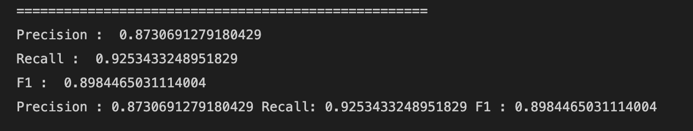

# Table Detection
Table Detection is one of the first and one of the most crucial step in many document analysis problem. Our goal for the Table Detection problem is to find the bounding region of a table whether or not it is bordered or borderless inside the Document. To solve the Table Detection problem, we are using [`Cascade mask Region-based CNN High-Resolution Network (Cascade mask R-CNN HRNet))`](https://github.com/DevashishPrasad/CascadeTabNet).


---
## I. Installation

1. Clone the repo into your machine and install the required packages:
```
git clone https://github.com/phamquiluan/Go5-Project.git
cd Go5-Project/table_detection
pip install -r requirements.txt
```

2. Install the dependencies for the model inside of `/Go5-Project/table_detection`:
```
pip install torch==1.4.0+cu100 torchvision==0.5.0+cu100 -f https://download.pytorch.org/whl/torch_stable.html
pip install -q mmcv terminaltables
git clone --branch v1.2.0 'https://github.com/open-mmlab/mmdetection.git'
```

3. Install the requirements of mmdetection framework `/Go5-Project/table_detection/mmdetection`:
```
cd mmdetection/requirements
pip install -r optional.txt
python setup.py install
python setup.py develop

cd /Go5-Project/table_detection/mmdetection/
pip install -r requirements.txt
pip install pillow==6.2.1 
pip install mmcv==0.4.3
```

3. Clone the repo of the Cascade mask R-CNN HRNet into the root `/Go5-Project/table_detection/`
```
cd /Go5-Project/table_detection
git clone https://github.com/DevashishPrasad/CascadeTabNet.git
```

4. Download the Pretrained Model into the `/Go5-Project/table_detection/checkpoint_path` dir. </br>
```
mkdir checkpoint_path
cd /Go5-Project/table_detection/checkpoint_path
gdown "https://drive.google.com/u/0/uc?id=1-mVr4UBicFk3mjUz5tsVPjQ4jzRtiT7V&export=download"
```

5. Set the appropriate paths inside `table_detection.py ` for the `config` and `path` then run the code:
```
python table_detection.py
```

For detailed instruction and installation, please follow: `Go5-Project/table_detection/table_detect_notebook.ipynb`

---
## II. Evaluation

### Our Result

By running inference with General Model Table Detecion checkpoint (link to download below) and TableBank latex test, we were able to produce the result below. 



### How to perform evaluation

To produce the evaluation in `table_detect_notebook.ipynb`, please download the [TableBank](https://doc-analysis.github.io/tablebank-page/) dataset and put it in `Go5-Project/table_detection` dir (the first set should be enough due to the size of the whole dataset).

Please set the correct paths for:

1. config_fname: `Go5-Project/table_detection/CascadeTabNet/Config/cascade_mask_rcnn_hrnetv2p_w32_20e.py`

2. Test .json file (this should be in the following path if you downloaded the dataset from the [link](https://doc-analysis.github.io/tablebank-page/) above): `/table_detection/TableBank/Detection/annotations/tablebank_latex_test.json'`

3. checkpoint_file_path: `Go5-Project/table_detection/checkpoint_path/epoch_24.pth` </br>
You can change the checkpoint by downloading some of the checkpoints of the Model below

4. image_name: `Go5-Project/table_detection/TableBank/Detection/images/`

Below are some of the Checkpoints of the model that we have tested out, please install and put them in this dir `Go5-Project/table_detection/checkpoint_path/`. Visit [CascadeTabNet](https://github.com/DevashishPrasad/CascadeTabNet) for more details.

<table>
  <tr>
  <th>Model Name</th><th>Checkpoint File</th>
  </tr>
  <tr>
  <td>General Model table detection</td><td><a href="https://drive.google.com/open?id=1-xfq5hDmFdKgbY9FSFTmhSlcb2p13RPn">Checkpoint</a></td>
  </tr>
  <tr>
  <td>ICDAR 13 table detection</td><td><a href="https://drive.google.com/open?id=1-mVr4UBicFk3mjUz5tsVPjQ4jzRtiT7V">Checkpoint</a></td>
  </tr>
  <tr>
  <td>Table Bank Word table detection</td><td><a href="https://drive.google.com/open?id=1-ZnV84t61IrkAfQH7dOATpo_T4C1J4Qa">Checkpoint</a></td>
  </tr>    
  <tr>
  <td>Table Bank Latex table detection</td><td><a href="https://drive.google.com/open?id=1-9EzU_LfD6fE8iJFjOZ3nBsCObqhpNUa">Checkpoint</a></td>
  </tr>    
  <tr>
      
</table>


